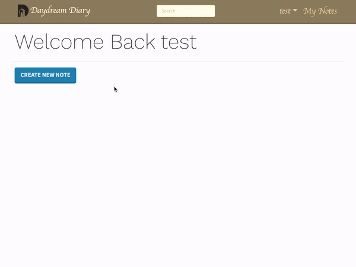
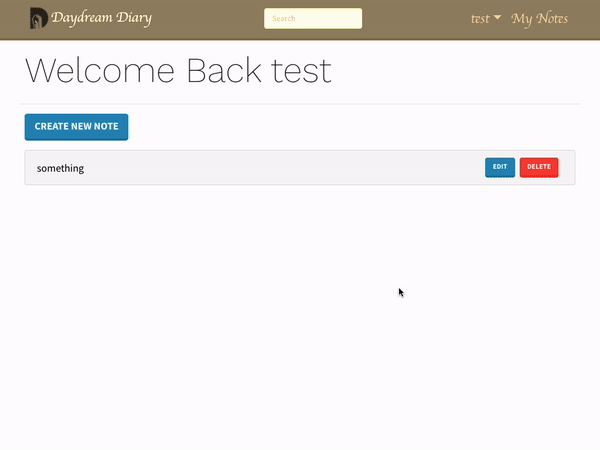
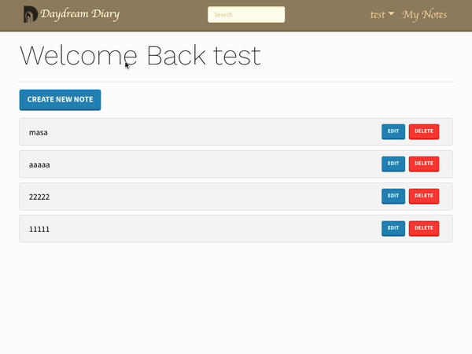

<h1 align="center">
Portfolio - Diary web app
</h1>
<h3 align="center">
📓  Take a note about your daydream anytime💭
</h3>

<p align="right"> 
</img>
</img>

</p>

## URL

&emsp;[Diary note app - https://note-app-masamern.herokuapp.com/](https://note-app-masamern.herokuapp.com/)

<br>

## Features

- MERN stack.
- Redux to manage state.
- Cloudinary to save photo.
- Search function for bunch of saved diaries.
- Fetch API.
- React Bootstrap is used for styling.
- Use Mongodb as database.
- Set Registration and authentication system with web token.
- Validation works.
- Fully responsive.

<br>

## Demo

<br>

1. Sign up(Mongodb is active, so you can sign up.)
<div>
    
</div>
<br>

2. Login with email and password.
<div>
    
</div>
<br>

3. Write diary as a login user.
<div>
    
</div>
<br>

4. Edit and delete diary.
<div>
    
</div>
<br>

5. Update profile.
<div>
    
</div>
<br>

6. Search diary.
<div>
    
</div>
<br>

## Proud of

- Applied saving photo function with "Cloudinary".
- State management with Redux.
- Run client and server with using "concurrently" module.
- No need to change environment variables when we run this program because I have set appropriate cors option in server side.

<br>

## Usage

&emsp;On the terminal under "portfolio_note-app" folder, hit the command below to launch web page on your local environment.

```
npm run dev
```

&emsp;Since Concurrently in installed as a module, client and server side programs will run at the same time.

<br>

## Deploy

- Heroku(For client and server side)
